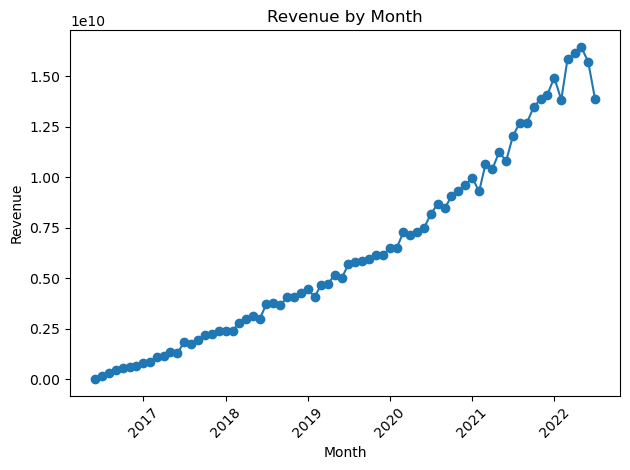
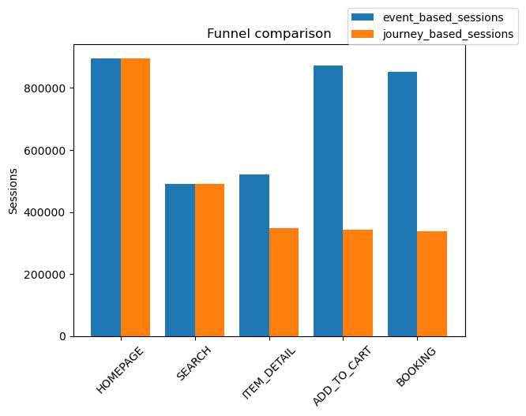
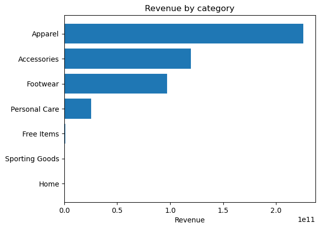

# Operations Analytics Project

This project analyzes an e-commerce dataset using SQL and Python to calculate key business KPIs and extract actionable operational insights.

---

## Business Context

The dataset represents a retail e-commerce business. The analysis focuses on three main KPIs:

- Monthly revenue  
- Purchase funnel  
- Revenue by category  

The objective is to understand business behavior and generate operational insights about its performance.

---

## Dataset

The dataset is composed of the following tables:

- **customer**: user-level information (demographics and attributes)  
- **transactions**: purchase-level information (products purchased, payment method and status), including nested product metadata  
- **product**: product-level information (category, subcategory, season, etc.)  
- **clickstream**: user behavior information (session-level events across the funnel)  

Due to their size, *transactions* and *clickstream* datasets are included as samples.

---

## Approach

- SQL queries to compute KPIs  
- Data transformation (product_metadata parsing)  
- Funnel analysis (event-based vs journey-based comparison)  
- Visualization using Python (Pandas and Matplotlib)  

---

## Key Analyses

### Revenue Over Time

Revenue shows a strong upward trend over time, with acceleration starting around 2019.  
From 2021 onwards, variability increases, suggesting changes in demand patterns or business dynamics.

The drop observed in the most recent months appears to be real (data is complete), which may indicate early signs of volatility or a potential slowdown that should be closely monitored.

---

### Purchase Funnel Analysis

Event-based counts do not follow a funnel structure, as later stages (*add_to_cart*, *booking*) show volumes similar to entry points. This indicates that event counts alone are not suitable to represent user journeys.

Journey-based analysis reveals a more realistic funnel, with a significant drop between *homepage* and *search*, suggesting that a large portion of users do not engage in active product discovery.

The discrepancy between event-based and journey-based metrics suggests the existence of multiple user behaviors, including direct purchase paths that bypass traditional browsing steps.

---

### Revenue by Category

Revenue is heavily concentrated in a few product categories, with **Apparel** dominating by a significant margin, followed by **Accessories** and **Footwear**.

The distribution follows a strong long-tail pattern, where several categories contribute minimally compared to the top performers.

This indicates a high dependency on core categories, which may represent both:

- an opportunity (focus on strengths)  
- a risk (lack of diversification)  

---

## Visualizations

### Revenue Over Time

### Funnel Comparison (Event vs Journey)

### Revenue by Category

---

## Key Insights

- Revenue shows three distinct phases:  
  - steady growth (<2019)  
  - accelerated growth (2019–2021)  
  - increased volatility (>2021), which should be monitored  

- Funnel analysis reveals multiple user behaviors, including both standard browsing journeys and direct purchase paths  

- Revenue by category is highly concentrated, indicating either strong specialization or lack of diversification  

---

## Next Steps

- Analyze seasonality in revenue to better understand volatility  
- Calculate funnel conversion rates to quantify drop-offs  
- Analyze revenue by category over time to track concentration dynamics  
- Segment users and transactions (e.g., by acquisition channel, product category, or customer type) to identify behavioral patterns  

---
