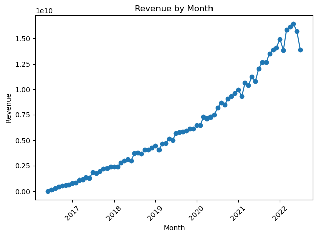
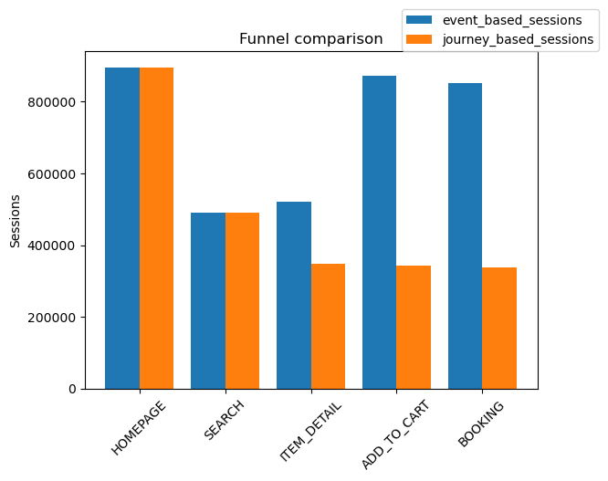
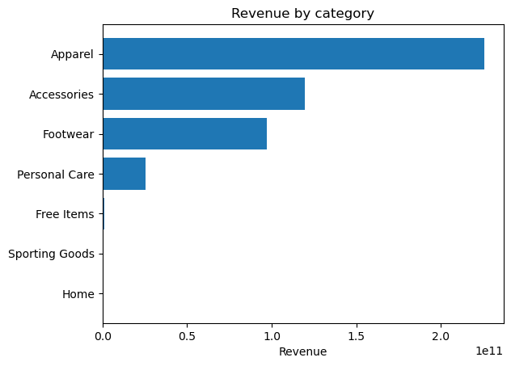
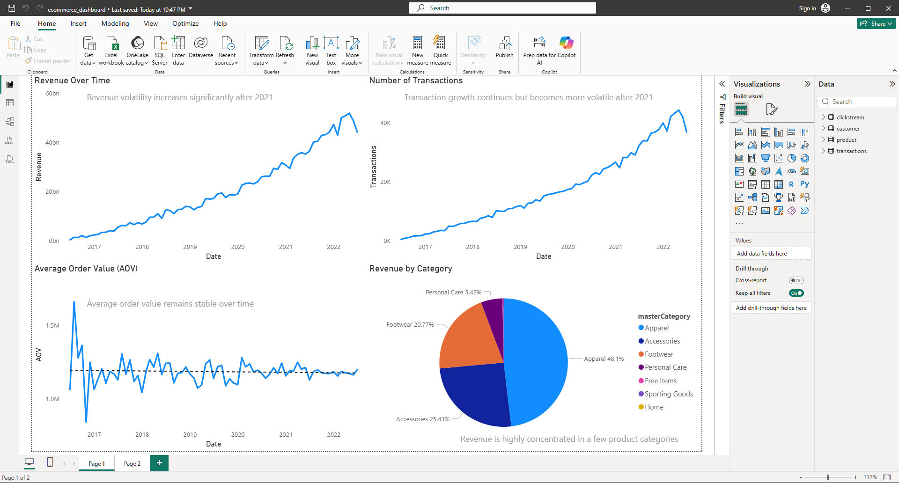
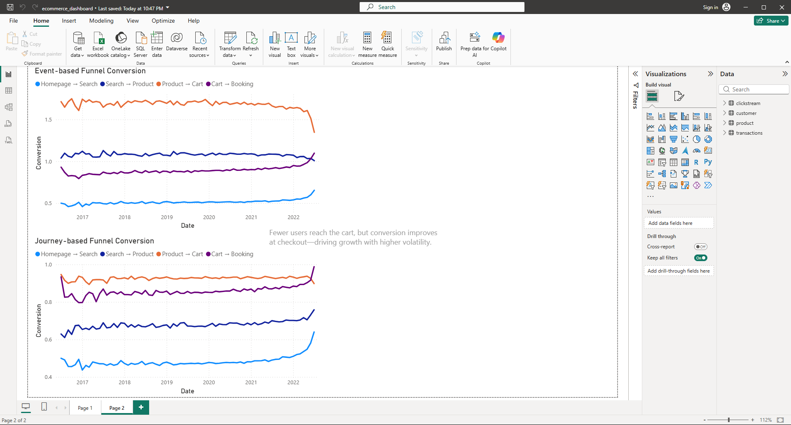
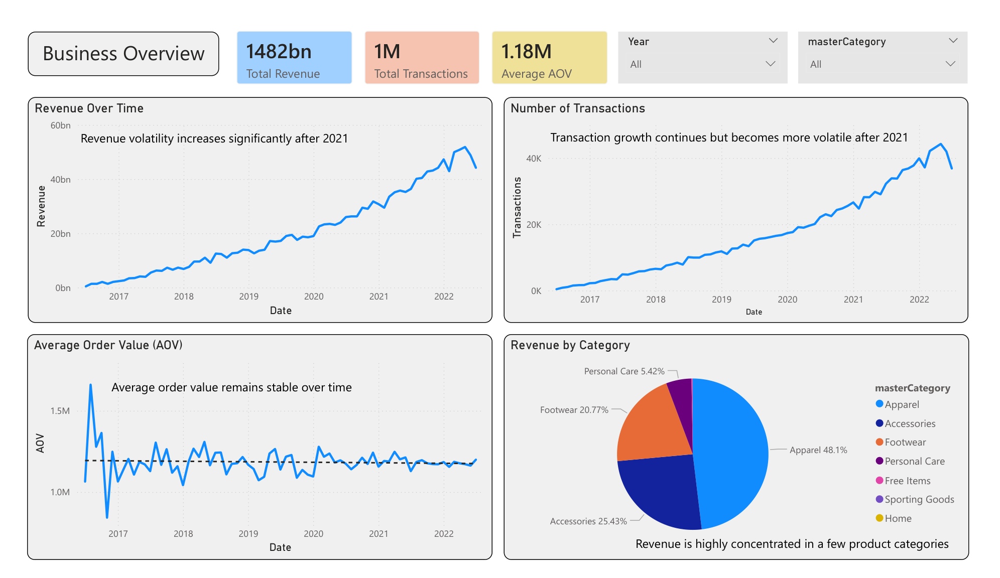
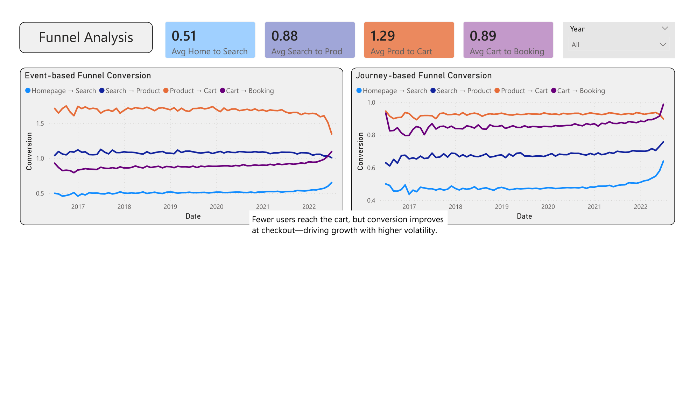

# Operations Analytics Project

This project analyzes an e-commerce dataset using SQL and Python to calculate key business KPIs and extract actionable operational insights.

---

## Business Context

The dataset represents a retail e-commerce business. The analysis focuses on three main KPIs:

- Monthly revenue  
- Purchase funnel  
- Revenue by category  

The objective is to understand business behavior and generate operational insights about its performance.

---

## Dataset

The dataset is composed of the following tables:

- **customer**: user-level information (demographics and attributes)  
- **transactions**: purchase-level information (products purchased, payment method and status), including nested product metadata  
- **product**: product-level information (category, subcategory, season, etc.)  
- **clickstream**: user behavior information (session-level events across the funnel)  

Due to their size, *transactions* and *clickstream* datasets are included as samples.

---

## Approach

- SQL queries to compute KPIs  
- Data transformation (product_metadata parsing)  
- Funnel analysis (event-based vs journey-based comparison)  
- Visualization using Python (Pandas and Matplotlib)  

---

## Key Analyses

### Revenue Over Time

Revenue shows a strong upward trend over time, with acceleration starting around 2019.  
From 2021 onwards, variability increases, suggesting changes in demand patterns or business dynamics.

The drop observed in the most recent months appears to be real (data is complete), which may indicate early signs of volatility or a potential slowdown that should be closely monitored.

---

### Purchase Funnel Analysis

Event-based counts do not follow a funnel structure, as later stages (*add_to_cart*, *booking*) show volumes similar to entry points. This indicates that event counts alone are not suitable to represent user journeys.

Journey-based analysis reveals a more realistic funnel, with a significant drop between *homepage* and *search*, suggesting that a large portion of users do not engage in active product discovery.

The discrepancy between event-based and journey-based metrics suggests the existence of multiple user behaviors, including direct purchase paths that bypass traditional browsing steps.

---

### Revenue by Category

Revenue is heavily concentrated in a few product categories, with **Apparel** dominating by a significant margin, followed by **Accessories** and **Footwear**.

The distribution follows a strong long-tail pattern, where several categories contribute minimally compared to the top performers.

This indicates a high dependency on core categories, which may represent both:

- an opportunity (focus on strengths)  
- a risk (lack of diversification)  

---

## Visualizations

### Revenue Over Time

### Funnel Comparison (Event vs Journey)

### Revenue by Category

---

## Key Insights

- Revenue shows three distinct phases:  
  - steady growth (<2019)  
  - accelerated growth (2019–2021)  
  - increased volatility (>2021), which should be monitored  

- Funnel analysis reveals multiple user behaviors, including both standard browsing journeys and direct purchase paths  

- Revenue by category is highly concentrated, indicating either strong specialization or lack of diversification  

---

## Project Evolution: From SQL Analysis to BI Dashboard

After completing the initial SQL and Python analysis, a key question remained:

**What is driving the increase in revenue volatility after 2021?**

To answer this, the project was extended using **Power BI** to explore business behavior in a more integrated and visual way.

---

## Power BI Dashboard (Iteration 2)

Due to file size constraints, the `.pbix` file is not included.  
The dashboard is presented through screenshots below.

### Key components

- Revenue and transactions over time
- Average Order Value (AOV)
- Funnel conversion over time (event-based vs journey-based)
- Revenue by category

---

### Revenue & Transaction Dynamics

Revenue growth closely follows transaction volume, while Average Order Value remains relatively stable over time.

This suggests that **revenue growth is primarily driven by transaction volume, not pricing**.

---

### Funnel Behavior Insights

The funnel analysis shows that most conversion steps improve over time. However, a significant drop appears at the **Product → Cart** stage.

At the same time, **Cart → Booking** conversion improves.

This suggests that fewer users reach the cart, but those who do are more likely to complete the purchase.

---

### Explaining Revenue Volatility

The combination of:

- reduced conversion into the cart
- improved checkout performance
- increasing dependence on transaction volume

makes the business more sensitive to user behavior fluctuations.

This helps explain the **higher revenue volatility observed after 2021**.

---

### Category Concentration Effect

Revenue is highly concentrated in a few categories, mainly **Apparel**, followed by **Accessories** and **Footwear**.

This increases business risk: any behavioral change in the main categories can have a disproportionate impact on total revenue.

---

## Dashboard Screenshots

### Overview Dashboard

### Funnel Analysis

---

## Final Takeaway

Moving from static SQL analysis to a Power BI dashboard allowed the project to connect:

- revenue dynamics
- user behavior
- funnel conversion
- product category concentration

This project demonstrates the ability to move from **data extraction → analysis → visualization → business interpretation**, using different tools to investigate a real operational question.

---

## Dashboard Redesign & UX Improvements

After the initial Power BI implementation, I revisited the dashboard design with a stronger focus on usability, business storytelling, and dashboard UX.

This redesign iteration focused on:

- Adding KPI cards to highlight the most important business metrics at first glance
- Introducing slicers and interactive filters to improve exploration and usability
- Improving dashboard hierarchy and layout organization
- Using a cleaner and more business-oriented visual style
- Increasing readability of titles, charts, and annotations
- Making the dashboards feel less like static analysis and more like operational BI tools

I also refined the Funnel Analysis page by summarizing conversion performance through aggregated funnel KPIs, allowing a faster understanding of user behavior across the purchase journey.

This redesign iteration was inspired by feedback from professionals working in Data Operations and BI environments, focusing on dashboard readability, UX, and business communication.

### Redesigned Business Overview Dashboard

### Redesigned Funnel Analysis Dashboard

---

## Next Steps

Based on the insights obtained from the BI dashboard, the next steps would focus on deepening the analysis and validating business hypotheses:

- Analyze seasonality patterns to better understand revenue volatility drivers
- Quantify funnel conversion changes over time, especially at the Product → Cart stage
- Track category-level revenue dynamics over time to assess concentration risk evolution
- Segment users and transactions (e.g., by acquisition channel, product category, or customer type) to identify behavioral patterns driving conversion differences
